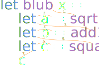

Function application is probably one of those terms in functional programming that sounds more
scarier as the topic really is. The idea behind functional application just means that we execute
a function to get the result. Let's take the example of calculating the square root of
`2.0`. We can write the following in F# to do that:

```fsharp
let x = sqrt 2.0
```

The interesting part is how we read this example. We read it from right-to-left.
`2.0` is the input to `sqrt`, `sqrt` returns the value `1.41` this is then stored in `x`.

<div class="svg-code" style="width:50%; margin: 30px auto">

</div>

Usually we just say that we *execute* or *run* the `sqrt` function. But in functional
programming the correct term is that we apply the value `2.0` to the function `sqrt`. Probably
you will ask how I can write a whole article about this topic, but there are some topics
associated with it.

# Partial Application

Partial application is one of those topics. If we pass all arguments to a function we name it
*function application*. But if we only pass some arguments to a function we name it
*partial application*.

In some programming languages it is an error if we don't pass all arguments to a function, but
in some functional languages, including F#, this is an explicit feature. The result of
partial application is a new function that accepts/waits for the remaining arguments. For
example: If we have a function `add` that expects two integers:

```fsharp
let add x y = x + y
```

But we only pass one argument to that function:

```fsharp
let add1 = add 1
```

Then partial application returns a new functions that expects the remaining argument. In the
above case we could say that we baked in `1` as `x` and `add1` expects the remaining
argument `y`.

```fsharp
add1 1  // 2
add1 10 // 11
```

# Immutability

Another big topic in functional programming is immutability. Immutability is a fairly easy
concept. It just means data cannot be changed after creation. If you are new to functional
programming or in general to this concept, this sound a little bit strange. How
can we do anything useful if we cannot change anything?

The answer is simple. Instead of changing any kind of data, we just generate new data.
Probably you wonder how this concept is associated with function application. While immutability
has no direct effect on function application, it changes the way how we think about
functions. With immutability in-place every functions must return a new value.

Let's look at some example code to understand why this kind of idea is important. Besides
`sqrt` we first create two new functions:

```fsharp
let square x = pown x 2
let add10 x = x + 10.0
```

We now create a new function that first calculates the square root of a number, add 10 to the
result of it, and finally squares the result. That function is pretty artificial so we just
name it `blub`:

```fsharp
let blub x =
    let a = sqrt x
    let b = add10 a
    let c = square b
    c

blub 2.0 // 130.28
```

The above code I wrote probably resembles the way how you write functions in a non-functional
language that also don't use immutability. But in this case every function returns a new value
and this style is a little bit verbose. But first lets look how we read this code:

<div class="svg-code" style="width:50%; margin: 30px auto">

</div>

I don't know you, but I think reading it is pretty horrible. The amount of *jumping around*
is quite high. If you don't think it is horrible then it just shows how much you are used
to this kind of writing. But lets examine the example a little bit further.

If you look at the visualization we can see some kind of pattern. We actually can
see two properties:

1. Every value is only used once.
2. The input of the next function is the output of the previous function.

The first property allows us to just embed or **nest** the function calls. There is no
reason why we store the result of a function explicitly in a variable if we anyway just use
the result once. We just can nest the code:

```fsharp
let blub x =
    let b = add10 (sqrt x)
    let c = square b
    c
```

We can repeat this step again. Also `b` is only used once, so we nest `b` again.

```fsharp
let blub x =
    let c = square (add10 (sqrt x))
    c
```

we also don't need `c`:

```fsharp
let blub x = square (add10 (sqrt x))
```

The final result is quite a lot shorter, but how do we read this code?

<div class="svg-code" style="width:75%; margin: 30px auto">

</div>

The final result resembles a normal function call. We just can read it straight from
right to left. Every function call returns a new result that is directly used as the
input of another function. With nesting we have once again a simple chain of execution.
No *jumping around* anymore to understand the code.

# Piping with |>

Up so far I only discussed the first property that a variable was only used once. But we
also had another property that the output of one function is the input of the
next function. We also could say, we have a chain of execution. The last visualization
already showed that chain as you could start on the right side and read the code to the left
until you are done.

But we also can reverse that chain so we can read it from left-to-right. We achieve that
style with the `|>` operator. The `|>` operator allows us to write the input of a function
on the left side and the function to execute on the right side.

<div class="svg-code" style="width:25%; margin: 30px auto">

</div>

With this idea we can reverse the input step by step like this:

<div class="svg-code" style="width:75%; margin: 30px auto">

</div>

The advantage is that `|>` is left-associative and has low precedence. In overall that means
when we see code like this:

    (.....) |> function

we can remove the parenthesis from the left-side of `|>` so we just end up with:

    ..... |> function

This means the last version:

```fsharp
let blub x = ((x |> sqrt) |> add10) |> square
```

also can be written without any parenthesis:

```fsharp
let blub x = x |> sqrt |> add10 |> square
```

This kind of style is often preferred in the F# community and can be read from left-to-right.

<div class="svg-code" style="width:75%; margin: 30px auto">

</div>

You often see this style in List manipulations:

```fsharp
[1.0; 3.0; 5.0; 7.0; 11.0; 13.0]
|> List.map sqrt
|> List.map add10
|> List.map square
// [121.0; 137.64; 149.72; 159.91; 177.33; 185.11]
```

We start with the data, and every new command is put on a new line. This way we easily
can create longer chains that are still readable and extensible.

# Never use <|

We can summarize `|>` as an operator that swaps the function and the input of a function. Usually
the input is on the right and the function on the left, and we say we read it from right-to-left.

With `|>` we swap the function and the input. The input is now on the left, and we read the code
from left to right. That's why I name it just left-piping.

F# also provides another operator `<|`. Before we look into what it really does, the question
is: What do you **expect** it should do?

Lets think about it. `|>` allows us to have the input on the left side of the function. We can
think of it that we pipe the input from left into the function on the right. So when we see `<|`
we just expect the opposite. We could say, the input on the right is piped to the function on
the left side. This opens up a new question: What is the difference between `<|` and
normal function application?

So let us explore `<|` step-by-step, and to understand why you never ever should use this
operator. We start with a simple case:

```fsharp
sqrt 2.0
```

We can insert `<|` in this term. But `<|` does not change the order of anything, we still
write the input on the right side. So we end up with:

```fsharp
sqrt <| 2.0
```

Seems pretty useless at this point. But if you remember, one advantage of `|>` was
that we also could eliminate some parenthesis. So lets create a small example where the
input is a more complex term that needs to be calculated:

```fsharp
sqrt (1.0 + 1.0)
```

At this point it is also helpful to understand what happens if we don't write the parenthesis.
The code above means. First calculate `(1.0 + 1.0)` and use the result `2.0` as the input
to `sqrt`. When we write:

```fsharp
sqrt 1.0 + 1.0
```

it basically means:

```fsharp
(sqrt 1.0) + 1.0
```

that means, first calculate `sqrt 1` and then add `1` to the result. If we use `<|`,
we can get rid of the parenthesis and still maintain the same behaviour.

```fsharp
sqrt <| 1.0 + 1.0
```

Believe me or not, but I don't see any improvement so far. I have seen a lot of people arguing
that the last version is better as the version with parenthesis. I don't think so. Reading
parenthesis and the idea that everything inside of parenthesis is calculated first is something
that we already learn in elementary school:

<div class="svg-code" style="width:50%; margin: 30px auto">

</div>

Now instead of a clearly visible grouping with characters that human mankind already use
for centuries, now you just use two different characters instead. It could be that you have
another opinion on this, this is okay, but let's continue to see more problems of `<|`.

The problem of `<|` is, we just think of it as right-piping. We **expect** that `<|` is
the reverse of `|>`. With a single function and a single argument, it also seems to work
this way. But this breaks as soon we try to extend the code. For example, when we now want
to add 10 to the result with our `add10` function.

With nesting we just write:

```fsharp
add10 (sqrt (1.0 + 1.0))
```

with left-piping we write:

```fsharp
1.0 + 1.0 |> sqrt |> add10
```

with right-piping you probably assume to write something like this:

```fsharp
// This code does not work
add10 <| sqrt <| 1.0 + 1.0
```

Probably that is what you **expect**. But this **isn't** how `<|` works! In fact, the above code
will just give you a compile-time error. Because of this, piping with `<|` is just an exceptional
bad idea. If you see code like this:

```fsharp
let blub x = x |> sqrt |> add10 |> square
```

you would probably assume that `<|` just reverse the pipe:

```fsharp
// This code does not work
let blub x = square <| add10 <| sqrt <| x
```

but this isn't at all how it works. So how does `<|` work instead? Probably at this point it
makes sense to add explicit parenthesis to understand how it works. And if you think
`<|` is better because of the elimination of parenthesis. Isn't it funny that I need to
add parenthesis so you are able to understand how `<|` actually works?

We actually **expect** that `<|` works in this way.

```fsharp
let blub x = square <| (add10 <| (sqrt <| x))
```

The above code is valid and will compile. But it is no improvement over:

```fsharp
let blub x = square (add10 (sqrt x))
```

But when we remove the explicit parenthesis in the first example. The code is interpreted like this:

```fsharp
let blub x = ((square <| add10) <| sqrt) <| x
```

And this is a truly exceptional bad idea. The problem of `<|` is that it is still
left-associative. That means, the thing on the left side is executed first. In the above case it
means. First `square` is executed and we pass it `add10` a function as the first argument
to `square`. This is a compile-time error because `square` expects a float, not a function.

But if we still continue to interpret this code, and ignore this error, we then expect that
`square <| add10` returns a new function as a result. We then execute that function by passing
`sqrt` as an argument. Well, `square` does not return a function, so this also cannot work.

And if we still ignore this error, we once again assume that this will return another new function
as a result that we then finally pass `x` as a value.

Already confused? And that's why `<|` is just an exceptional bad idea, and you never ever
should use `<|`. `<|` is just broken, it isn't at all how someone thinks it works or should work.

At least let me give you a quick example that shows how `<|` works and in which situation
it would *theoretically* make sense. First you need a function that expects at least two arguments:

```fsharp
let add x y z = x + y + z
```

Now imagine all arguments are some more complex terms that you compute, usually you have to
put parenthesis around every term to group them:

```fsharp
add (1 + 1) (2 + 2) (3 + 3)
```

This is just a function call with three arguments. But every arguments is calculated before
`add` is called. In such a case, you could use `<|` instead of parenthesis:

```fsharp
add <| 1 + 1 <| 2 + 2 <| 3 + 3
```

The whole example is read like this:

<div class="svg-code" style="width:50%; margin: 30px auto">

</div>

Overall `<|` is just another delimiter that you could use instead of parenthesis. But
this kind of behaviour is not really how you would expect it to work. As left-piping with
`|>` is used a lot, you would think `<|` just does the reverse. So in general right-piping
only adds more confusion and it is better to not use it at all.

<div class="info">
If it is unclear why `<|` works in this way. Lets add the parenthesis back in the last example.

```fsharp
((add <| 1 + 1) <| 2 + 2) <| 3 + 3
```

The first thing that is executed is `(add <| 1 + 1)`. This means first `1 + 1` is calculated and
the result `2` is passed to the `add` function as the first argument. But the parenthesis around
this term end this term. So what do we really do? We basically *partial apply* `add` with a single
argument. This then returns a new anonymous function that expects the remaining arguments
`y` and `z` of `add`.

Then `2 + 2` is calculated and this is once again *partial applied* to that anonymous function. This
then returns another new anonymous function that expects the last argument `z`. And to this function
we finally apply `3 + 3` to it what then executes everything.
</div>

# Nesting again

Writing code in a piping style with left-piping is probably the most common and most used
way you see in F#. Its not that this is in general a bad idea, but it can be bad if people
try to solve everything this way. It is important to understand when it is a good idea
and when not.

Piping is only a good idea if:

1. The last argument of a function is a more complex computation
2. A function only has a single argument that is the result of another function
3. You need to chain multiple of those functions in one explicit order

To understand those restriction better, let's talk about the List module. Why can we usually
chain most of the List functions? For example we can create something like this:

```fsharp
[1..100]
|> List.filter (fun x -> x % 2 = 0)   // [2; 4; 6; 8; ...]
|> List.map (fun x -> x * 2)          // [4; 8; 12, 16; ...]
|> List.fold (fun acc x -> acc + x) 0 // 5100
```

The first reason is the order of the arguments. All of those functions expects the list as the
last argument:

```fsharp
List.filter predicate list
List.map mapper list
List.fold folder state list
```

But even if we switch the order of the arguments we always can use piping, but it probably isn't
more readable anymore. If we for example assume the `List.map` functions first expects a list
and then the *mapper* function, we would write something like this with piping:

```fsharp
(fun x -> x * 2) |> List.map list
```

Let's consider we had the same swapping in List.filter

```fsharp
(fun x -> x % 2 = 0) |> List.filter [1..100]
```

As `List.map` used the result of `List.filter` in our first example we would end with something
like this if *map* and *filter* had swapped arguments:

```fsharp
(fun x -> x * 2) |> List.map ((fun x -> x % 2 = 0) |> List.filter [1..100])
```

But this kind of code is not readable or understandable at all. So a good choice for the
last argument is usually some kind of immutable data-type. But that is not everything. In
`List.fold` we have two immutable data-types. The `state` and the `list`. So why is `list`
the better choice? Because a list is very likely the result of a more complex computation.
The `state` is almost always just a plain direct value like `0` or an empty list and so on.
Very unlikely will you have a complex computation that computes the `state`.

As a thumb of rule we can say: It is a good idea if the output type of a function and the type of the
last argument is the same. Most of the functions from the List module are build that way. Most of those
functions return a new list, and most of them also expect a list as the last argument. It is in some
sense only natural that if you have dozens of functions that operate, transforms or create list that
you want to compose these functions together.

Picking the correct last argument of a function is important, but that is not everything. The
problem is, sometimes you don't have one clear value to put as the last argument, sometimes more
than the last value gets computed, and so on. Whether or not piping is a good case also depends
on the argument itself. Let's pick another function to explore this behaviour: `List.append`

The purpose of `List.append` is to append two lists together into one list. Whether or not piping is a
good choice now depends on the arguments itself. If only one argument is computed, it still works
fine with piping.

```fsharp
[1..100]
|> List.filter (fun x -> x % 2 = 0)   // [2; 4; 6; 8; ...]
|> List.map (fun x -> x * 2)          // [4; 8; 12, 16; ...]
|> List.append [100;50]               // [100; 50; 4; 8; 12; ...]
```

But if both lists are the result of a computation, then nesting is a much better choice.

```fsharp
let add1 x = x + 1.0
let sub1 x = x - 1.0

// Using Nesting
List.append
  (List.map square (List.map add1 [1.0 .. 5.0]))
  (List.map square (List.map sub1 [1.0 .. 5.0]))

// The same as above with partial piping...
[1.0 .. 5.0]
|> List.map sub1
|> List.map square
|> List.append (List.map square (List.map add1 [1.0 .. 5.0]))

// ...with even more piping
[1.0 .. 5.0]
|> List.map sub1
|> List.map square
|> List.append ([1.0 .. 5.0] |> List.map add1 |> List.map square)

// ...full piping including the evil <|
[1.0 .. 5.0]
|> List.map add1   // <-- add1 instead of sub1!!!
|> List.map square
|> List.append <| ([1.0 .. 5.0] |> List.map sub1 |> List.map square)
```

Also notice that in the last version, the parenthesis at the right of `<|` are still important
and the whole order of `List.map add1` and `List.map sub1` changed!

<div class="info">
Do you understand why <code>add1</code> and <code>sub1</code> needs to be swapped in the last example?
Consider the following function:

```fsharp
let sub x y = x - y
```

Now look at those three definitions and their results:

```fsharp
sub 5 3       // 2
3 |> sub 5    // 2
3 |> sub <| 5 // -2
```

In the first and second example `5` is the first argument to `sub`. It is also the
first argument in the second example because function application has a higher precedence
as `|>`. In the last example there is no direct function application anymore and `3 |> sub`
is executed first and `3` becomes the first argument of `sub`. With explicit parenthesis, the code
is interpreted like this:

```fsharp
sub 5 3         // 2
3 |> (sub 5)    // 2
(3 |> sub) <| 5 // -2
```
</div>

Before we go further lets formalize why this kind of code is so hard to write with piping.
We have this problem because we don't have a single chain of computations anymore. We have two paths
of computation that are different. When we call `List.append` it is just a way to combine
those two computations. In other words, our computation resembles a tree.

<div class="svg-code" style="width:50%; margin: 30px auto">

</div>

Piping is not a good tool for those kind of trees. Piping is only a good option for
computations that works in a linear/sequential way. Nesting on the other hand don't have
this problem. If some argument is a more complex computation we always can surround the term
with parenthesis and embed the term where we need it. Look once again at the math example
to understand this:

<div class="svg-code" style="width:50%; margin: 30px auto">

</div>

If you don't see the tree in it. First consider that operators like `+`, `-` or `*` are just
binary operators that expects two arguments. So a term like `5 + 5` also could be represented
as a tree. `+` is the node with two arguments.

<div class="svg-code" style="width:25%; margin: 30px auto">

</div>

You can apply this idea to the whole math formula `(5 + 5) * (3 + (6 * 2))`:

<div class="svg-code" style="width:100%; margin: 30px auto">

</div>

The only problem we have is to properly write those nesting so it is still readable. It isn't
useful if a line expand further and further. We need to properly format the code so we can
better understand it. And there is an easy way to format code with nesting. If things starts
to get too long we just can put every argument on a new line and indent it. We already have
seen this in the nested `List.append` example.

<div class="svg-code" style="width:100%; margin: 30px auto">

</div>

In fact these kind of formatting works with any kind of tree like structure no matter how
complicated it seems. Here you can see a visualization of a tree and how you represent
it with indentation.

<div class="svg-code" style="width:100%; margin: 30px auto">

</div>

In fact, if you ever have written HTML or XML you should be comfortable with this. Both document
formats are tree structures. You have a starting and an end-tag. Inside of a tag you can nest
other tags to create hierachical structures. The rules you already use to properly indent
and format HTML also can be used to format and indent nested code with parenthesis.

Up so far we have seen two kinds of code. One kind is sequential. With sequential code we can
use piping for a better representation. But if we have tree like structures just normal
nesting is quite better. The question we should ask is: Should we try to represent
anything as a sequence?

The answer is actually, no. Not everything can be written in a linear way. I would even argue
that representing things as trees is easier. Trying to fit everything into a piping style just
can limit the view in how to solve problems in general. This is best described with
an example.

# Binary Converter

In our example we want to write a function that can convert any number into a binary string
representation. Before we start coding we actually need to know an algorithm that
solves our problem.

The algorithm I describe does not only work for converting numbers to binary, we also can
convert numbers to other bases like octal, hexadecimal and so on. For demonstrating the
algorithm I first show how we convert a number into decimal because it is a lot easier to follow.

In general the algorithm works by removing one digit from a number, convert it into a string
and repeat that process for the remaining number. That description also already tell us that we
have a recursive algorithm.

The first step is to remove one digit from a number. We achieve this by using the modulo operation.
When we calculate `x % 10` we always get the right most digit of a number. This is just
a single digit between zero and nine. This allows us to create a function that just can convert
any digit to its string representation.

For example when we start with the number `225` we calculate `225 % 10` and get `5` out of it.
This `5` then can be passed to a function that knows how to transform the numbers zero to nine
to a string.

But we are not finished after this step. We only transformed the `5` from `225` into a string.
But we still need to transform the remaining digits `22`. So we actually need a way to *remove*
`5` from `225`.

We achieve that by dividing by the base. First we subtract `5` from `225`. So we get `220`.
Then we divide by ten to get `22`. In general dividing or multiplying a number by its base means
we can shift the value. Multiplying by the base means we add zeros at the right of a number. Dividing
by the base means we remove zeros.

So the step to transform 225 into a string are:

<div class="svg-code" style="width:25%; margin: 0 0 1rem 30px">

</div>

As you can see. Every modulo operation returns the right most digit of a number. By subtracting that
digit and dividing by 10. We get a new number. We just repeat that process until we end up at zero.

As said at the beginning. This algorithm works for any base. If we want to convert a number into a
binary representation we just do modulo 2 and divide by 2.

<div class="svg-code" style="width:25%; margin: 0 0 1rem 30px">

</div>

If we concatenate the modulo operation we get "1110 0001" as the result. So, how do we transform
this algorithm into code? We could write the whole computations directly. But it is usually
easier to decompose the problem into smaller parts, or functions in our case. So lets split the
various steps into functions with meaningful names.

First we need a way to extract the right most digit from a number. So we just create a function
`extract` that does this step.

```fsharp
let extract x = x % 2
```

Once we have such a function, we actually need a way to transform the digits
returned by `extract` to a string.

```fsharp
let toString x =
    match x with
    | 0 -> "0"
    | 1 -> "1"
    | _ -> failwith "This should not happen"
```

Another function we need is the idea of right-shift a number. With a decimal number we turn the
number `225` to `22`, with binary we turn `225` into `112` ((225 - 1) / 2) *)

```fsharp
let rightShift x = (x - (extract x)) / 2
```

Are we done? Well, let's try to create a binary convert at this point. We could come up with
code like this:

```fsharp
let rec toBinary x =
    let rightEnd = toString (extract x)
    let rest     = toBinary (rightShift x)
    ...
```

So we calculate two values. First we extract the right most digit and convert it into a string.
If we have `225` as input this would be the first step in our calculation and the string `"1"`
is stored in `rightEnd`.

When we call `rightShift x` the result is `112`. But what do we do with that? Well, this is the
reason why it is a recursive function. We need to repeat the calculation until we end up
with zero. That's why we pass the result to `toBinary` immediately.

If you are not used to recursion it can probably be hard to understand what this will return.
In recursion you just make the assumption the the recursive call just somehow works. So what is
the result of `toBinary (rightShift 112)`? It is the string representation of the number `112`.

So what do we have exactly? We have the first right most bit. It is stored inside `rightEnd`,
and in `rest` the rest of the transformation is saved. In our example this means:

```fsharp
rightEnd = "1"
rest     = "1110000"
```

The "missing" part we currently have is, that we need to combine those two strings into a single
string. So we need another function that can concatenate two strings:

```fsharp
let concat x y = String.concat "" [|x;y|]
```

 Now we have two computations that we merge together, we write:

```fsharp
let rec toBinary =
    concat
        (toBinary (rightShift x))
        (toString (extract x))
```

But we are still not done. We need a way to abort the recursion. Currently the function
would loop forever (Theoretically, practically it blows up with a stack overflow exception).

So we need to check if `rightShift x` reached zero. If it reached zero we just use an empty
string for the string concatenation, otherwise we use the result of the recursive call
for the string concatenation.

```fsharp
let rec toBinary =
    concat
        (if (rightShift x) = 0 then "" else toBinary (rightShift x))
        (toString (extract x))
```

All functions we created are only useful for the `toBinary` function, we also can embed
all functions inside `toBinary` in this case. So our final solution looks like:

```fsharp
let rec toBinary x =
    // Helper functions
    let extract x    = x % 2
    let rightShift x = (x - (extract x)) / 2
    let toString     = function
        | 0 -> "0" | 1 -> "1"
        | _ -> failwith "This should not happen"
    let concat x y = String.concat "" [|x;y|]

    // Main algorithm
    concat
        (if (rightShift x) = 0 then "" else toBinary (rightShift x))
        (toString (extract x))

toBinary 0   // "0"
toBinary 178 // "10110010"
toBinary 225 // "11100001"
```

As a summary, what did we learn so far? I hoped to show, that working with a nesting style
of functions is actually more easier to work with, and also a lot more natural in some cases. In
the case of a binary converter we really have two computations or a tree of computations. Not trying
to think with piping in mind actually makes a lot of stuff easier.

When we face a problem we just decompose a problem into solvable small functions. Once we decomposed
a problem we need to compose the small parts back together. The problem is, sometimes that problem
can be naturally represented as a sequence of operations, but most of the time it can't. In our
case we also don't have a single sequence of computation. On every recursive step we really
have two computations.

One computation determines the next character for our result. And another computation calculates
the next number we need to recurs on. We end up with two computations, two strings that
in the end need to put together into a single result. This algorithm is best visualized by a tree.

<div class="svg-code" style="width:50%; margin: 30px auto">

</div>

And the classical way to represent trees with code is by nesting and indentions. Piping is
not a good approach to represent tree structures. If you want to try to solve everything by
some kind of piping even before you determined if the problem is even solvable in a sequential
manner, you will only run into problems and will have a hard time to solve these kind of problems.

# Composition

What we have seen so far is function application. Function application means to apply a value to
a function, or in other words. Execute a function to get the result of a function. Function
composition on the other hand is completely different. It means, combine two or more functions
together to create a new function. Even if it seems like two different tasks in theory, in practice
the difference isn't too big.

Let's go back to our `blub` function. We started with:

```fsharp
let blub x = square (add10 (sqrt x))
```

This code is written with nesting. But as you can see, the real goal was not to execute
the chain of functions we have. The goal was to create a new function. In such a case, we also
can use function composition instead.

```fsharp
let blub = square << add10 << sqrt
```

In this example you can see that the most natural way to write nesting as function composition
is to use `<<`. With nesting we read the code from right to left. On the right is the input of
a function, on its left the output. The `<<` operator preserves this structure. The input of
`square` is the result of `add10`. The input of `add10` is the result of `sqrt`. And the input
of `sqrt` becomes the input of the `blub` function.

The advantage of function composition is that we can omit parenthesis and variables even further.
We also don't need explicit function arguments. If we use `>>` instead of `<<` we just can
reverse the whole chain this time.

```fsharp
let blub = sqrt >> add10 >> square
```

This is also an even further example why `<|` is bad. It is only natural to think that `<<` and
`>>` are somewhat the same only in reverse order, and sure they are. But this is not the case
for the combination `<|` and `|>`. The piping operators are really two completely distinct operators
that work differently.

While function composition is a little bit shorter compared to piping, the difference isn't that much.
Because of some problems in F# with the type-inference it also can be that this approach sometimes
creates a **Value restriction** error. If you encounter such an error, the best fix to those kind
of error is just to create a function with explicit arguments instead of function composition.
As the difference is anyway not too big, you also always can use nesting or piping instead of
function composition.

One place where function composition is a better choice is if you want to pass a function
as an argument to another function. Let's look at our `blub` function again. We first can
create the `blub` function and then use it in `List.map`.

```fsharp
let blub = square << add10 << sqrt
List.map blub [1.0 .. 100.0]
```

But if you need `blub` only in a single place, it is a little bit annoying to explicitly create and
name a function. It is just better to inline the whole function. Without function composition we need
to write something like this:

```fsharp
List.map (fun x -> square (add10 (sqrt x))) [1.0 .. 100.0]
```

With function composition on the other hand we can shorten this example to:

```fsharp
List.map (square << add10 << sqrt) [1.0 .. 100.0]
```

# Best Practices

At the end I just want to gather some best practices. Those are best practices from me and
like always, every person usually disagree with another 10%.

1. Never use `<|`. People think of it as the reverse of `|>` but it isn't.
2. If you disagree with 1. then at least never mix `|>` and `<|` in a single statement.
3. Never mix `<<` and `>>` in a single-statement. `f >> g >> h >> i` or `f << g << h << i` is
   easy to understand. `f << g >> h << i` isn't.
4. Don't favour piping over nesting. Piping is only good for strict sequential code. Favour piping
   over nesting means you limit the way you think.
5. If you create new functions. Don't think of piping too much. It is good if you can pipe
   functions, but it is not bad if you cannot do that. Not every function works good with piping.
6. Try to **solve your problem first**. Because nesting is good for any kind of tree structure and
   thus more powerful. Try to use nesting by default.
7. **After** you solved a problem and realized that the code can be represented by a sequence with
   piping. Refactor the code with piping.
8. If possible, use function composition if you pass functions as arguments instead of lambda functions.

# Summary

Overall we covered function application and composition. We saw function application with nesting
or piping with operators like `|>` or `<|`. We also can use function composition with `<<` or
`>>` in certain situation.

I hope in this article you learned how all of those operators work, and more important, when you should
use which kind of style. Nesting, piping and function composition are three ways to either execute
or compose functions. But not any of those are good in any situation.

Especially piping is overused in F# in my opinion. Not every problem can be expressed naturally
in a sequential way of piping. So don't view any problem as a nail that you solve with a hammer.
