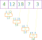

A very important function in List-processing is the `List.fold` function.
`List.fold` is a very powerful function that gives you a lot of flexibility
to do any kind of list transformation. The disadvantage is that this kind of
power makes understanding `List.fold` a lot harder. In this article we
look at some visualizations to better understand `List.fold`.

First we need to understand how we visualize a function. A function has some
inputs and one output and we visualize it as a box with the inputs on
the top and the output on the bottom. As an example this function and
functions call:

```fsharp
let times2 x = x * 2

times2  5 // 10
times2  7 // 14
times2 10 // 20
```

Will be visualized like this:

<div class="svg-code" style="width:50%; margin: 30px auto">

</div>

We visualze a list like `[1;2;3;4;5]` like that:

<div class="svg-code" style="width:80%; margin: 30px auto">

</div>

We don't directly jump to `List.fold`, instead we work towards `List.fold` by
first looking at `List.map` and then `List.reduce`.

## List.map

We could visualize a call like `List.map times2 [1;2;3;4;5]` with the technique
we have seen so far. Draw a box with two inputs and a list as output. But we
are not interested in visualizing the `List.map` call itself, we want to
visualize how `List.map` internally works.

We can think of `List.map` as a function that applies its first argument, a function,
to every element of the list passed as the second argument.

<div class="svg-code" style="width:75%; margin: 30px auto">

</div>

`List.map` is a very useful function as executing a function for every element is
often needed in programming. On the other hand it is the exact opposite
of powerful, it is a very specific function that only can manipulate one element
of a list at a time. For example we cannot add all values of a list together, filter a
list and do other kind of things with a list.

## List.reduce

To understand `List.reduce` I use an example that is often used by others.
First let me say that I don't think this is the best way to explain `List.reduce`
but it is still a good start.

```fsharp
List.reduce (+) [1;2;3;4;5] // 15
```

The result of the above statement is `15`. You can imagine that `List.reduce`
just puts the `+` between every element in the list:

    1 + 2 + 3 + 4 + 5

It isn't the best explanation because as it doesn't explain what this means:

```fsharp
List.reduce someFunc [1;2;3;4;5]
```

Putting `someFunc` between every element doesn't seem to make any sense!

```fsharp
// What does that mean?
1 someFunc 2 someFunc 3 someFunc 4 someFunc 5
```

But we ignore this for a moment.

First, we need to understand that `+` is also just a function. For example
we could visualize `7 + 9` like this:

<div class="svg-code" style="width:25%; margin: 30px auto">

</div>

Second, if we calculate `1 + 2 + 3 + 4 + 5` in our head then we don't do
it in one big step. We actually do a lot of steps and create a lot of
intermediate results.

We first calculate `1 + 2` and keep `3` in our head. Then we calculate
`3 + 3` and keep `6` in our head. Then we calculate `6 + 4` and finally
we do `10 + 5` in our head. If we add parenthesis around every step we
do something like this in our head:

```fsharp
((((1 + 2) + 3) + 4) + 5)
```

This idea of doing multiple calculations and remembering an intermediate
value after each step is exactly how `List.reduce` works.

<div class="svg-code" style="width:80%; margin: 30px auto">

</div>

This visualization also explains how `List.reduce` works if we pass it other
functions instead of operators like `+`.

```fsharp
List.reduce max [4;12;18;7;3] // 18
```

<div class="svg-code" style="width:80%; margin: 30px auto">

</div>

We also can write it with parenthesis:

```fsharp
(max (max (max (max 4 12) 18) 7) 3)
```

This is how `List.reduce` works, but also `List.reduce` has some limitations.

First, what should `List.reduce` do if you only pass a list with one or zero
elements? In the case of one argument it just returns this one element without
that functions like `+` or `max` is executed once. In the case of zero arguments
it throws an exception.

A second limitation is that we are still limited in which kind of list
transformations we can create. This becomes more obvious if we look at the
types of the function that we must pass to `List.reduce`. We must pass
a function where all input and output types are the same and must be of
the type that the list contains.

This becomes obvious if we look at how `List.reduce (+) [1;2;3;4;5]` works. The
first calculation it does is `1 + 2`. So it passes `1` as the first argument
and `2` as the second argument to `+`. As both values come from the same list
and all values in a list must be of the same type it means both input values
must be the exact same type of the list.

As the result of `1 + 2` is again passed as the first argument to the next
`+` call it also means the output of a function must be the same as its
input type.

This means when we pass a list of `int` to `List.reduce` then we must pass a
`int -> int -> int` function to `List.reduce` and overall it also returns
an `int` as the final value. More general, we need a function of type:

    a -> a -> a

Another way to describe how `List.reduce` works is to say it combines the first
two values of a list into a new single value and repeats doing this step until
we end up with a single value that is then returned.

<div class="svg-code" style="width:75%; margin: 30px auto">

</div>

The first visualization we have seen is more accurate, but also this
kind of idea leads you to the correct result of any `List.reduce` call.

## List.fold

Finally we are at `List.fold`. The way how `List.fold` works is pretty much
the exact same as `List.reduce`! The only difference is that we pass an
initial starting value. Doesn't seems like a big deal but this initial
value fixes all limitations of `List.reduce`.

```fsharp
List.fold (+) 0 [1;2;3;4;5] // 15
```

The `List.fold` call above internally does something like this:

<div class="svg-code" style="width:80%; margin: 30px auto">

</div>

Overall `List.fold` does one additional calculation compared to `List.reduce`
because we pass it an initial value. But because of this it also always can
return a value even if we pass it an empty list. This way it doesn't need
to throw an exception.

The biggest advantage is that we can use different types. As the initial
value is not part of the list it also can be another type.

The initial value is passed as the first argument to the folder function,
the folder function then returns a new intermediate result that is used
for the next call. This tells us that the first argument and the return
value must be of the same type.

Only the second argument of the folder function must be the type thats inside
of our list.

<div class="svg-code" style="width:50%; margin: 30px auto">

</div>

Let's say we want to traverse a list and build a string where every number
is just concatenated. Then we already know that the initial value must be
a string. The initial value must be a starting value, so we use the empty
string. Next we know that the the first argument of the folder function
is the initial value or any intermediate string, the second argument is
one element from the list, and we must return the next intermediate string
(or final return value).

```fsharp
List.fold (fun acc x -> acc + (string x)) "" [1;2;3;4;5] // "12345"
```

The execution of the above function looks like this:

<div class="svg-code" style="width:100%; margin: 30px auto">

</div>

Instead of **initial** or **intermediate** value we use the term **accumulator**,
hence the name `acc` in the anonymous function.

Now i want you to look at the following code:

```fsharp
let mutable acc = ""
for x in [1;2;3;4;5] do
    acc <- acc + (string x)
```

Can you see the similarities with the `List.fold` function call?

<div class="svg-code" style="width:100%; margin: 30px auto">

</div>

In some way we can say that `List.fold` for immutable data-types is what a
**for-loop** is for mutable data-types. `List.fold` is what you get if you try
to eliminate all mutable variables and data-types. The whole purpose of looping
is to mutate some state that is usually defined outside of the loop. In
`List.fold` on the other hand the new state is always passed as an argument
and we need to return the new state for the next function call.

It becomes more obvious if we go through the states of `acc` in the loop based
code. We start with the empty string `""`. In the first loop iteration `x` is
assigned `1` and we append this to `acc` and `acc` is set to `"1"`. The second
loop iteration assigns `"12"` to `acc` and so on. These are exactly the states
our **folder** function return in the `List.fold` example.

You also can easily convert other loop code to a `List.fold`. As an example:

```fsharp
let mutable amountOfEvenNumbers = 0
let mutable sumOfEvenNumbers    = 0
for x in 1 .. 10 do
    if x % 2 = 0 then
        amountOfEvenNumbers <- amountOfEvenNumbers + 1
        sumOfEvenNumbers    <- sumOfEvenNumbers + x

amountOfEvenNumbers // 5
sumOfEvenNumbers    // 30
```

Written as a fold:

```fsharp
let folder (amount,sum) x =
    if   x % 2 = 0
    then (amount+1, sum+x)
    else (amount, sum)

let (amount, sum) = List.fold folder (0,0) [1..10]

amount // 5
sum    // 30
```

It's a bit different. As a `List.fold` only supports one initial value
we use a Tuple with two values. In the mutation based code we don't need an
*else* branch as nothing happens with an odd number. In the `List.fold`
example we must explicitly return the unchanged state.

## List.foldBack

As `List.fold` is basically just a for-loop it should now become clear why it
is so powerful, yet some task are harder as it seems. As an example we want
to build our own `List.map` with the help of `List.fold`.

As the return value is a list our initial value also must be a list and we
start with the empty list as the initial value. Then we execute a user-defined function
for every element and the result must be added to the empty list.

We could write something like that:

```fsharp
let map' f list =
    let folder acc x =
        let newElement = f x
        newElement :: acc
    List.fold folder [] list

map' times2 [1..5] // [10; 8; 6; 4; 2]
```

The problem is how we build the list. The cons operator `::` only can prepend
an element to a list, not append. Because of this we get `[10;8;6;4;2]` instead
of the expected `[2;4;6;8;10]`.

It is possible to write an `append` function that appends a single element to
a list. The general problem is that this is a very inefficient operation with
an immutable list. Whenever you append an element a whole new list must be
created and all elements must be copied.

A better approach would be to traverse the list in reverse order. We start at
the end (the right side) and prepend the result to an empty list. This is
excactly how `List.foldBack` works.

```fsharp
let map'' f list =
    let folder x acc =
        let newElement = f x
        newElement :: acc
    List.foldBack folder list []

map'' times2 [1..5] // [2;4;6;8;10]
```

<div class="svg-code" style="width:80%; margin: 30px auto">

</div>

If you look at the visualization it also becomes clear why the order of the initial
value is different. In `List.fold` you start from the left and the initial value
is also places on the left-side from the list.

In `List.foldBack` we start at the right and we also place the initial value at the
right-side of the list. The `List.fold` and `List.foldBack` resembles that idea.

```fsharp
List.fold     folder initialValue list
List.foldBack folder list         initialValue
```

Also the folder function receives the accumulator as the second argument
(right argument) in `List.foldback` while `List.fold` receives it as the first
argument (left argument).

## Exercises

If you truly want to understand those function you should do some exercises.
As an exercise you should re-create the following List functions with either
`List.fold` or `List.foldBack`.

| Function    | Description |
|:------------|:-----------|
| length xs | Returns the amount of elements in a list |
| rev xs    | Reverses a list |
| map f xs  | Runs a function on every element of a list |
| filter predicate xs | Only keep those elements that predicate returns true for |
| forAll predicate xs | Returns true if all elements of the list return true for the predicate |

## Summary

Other languages use different namens for these operations, but the logic
stays the same.

|   | List.fold | List.foldBack | List.reduce | Comment |
|:--------|:----------|:---------------|:------------|:--------|
| **C# (LINQ)** | Aggregate | N/A | Aggregate | Aggregate accepts 2 or 3 arguments |
| **JavaScript** | Array.reduce | Array.reduceRight | Array.reduce | Array.reduce accepts 2 or 3 arguments |
| **Elm** | foldl | foldr | N/A | None |
| **Haskell** | foldl | foldr | foldl1 | None |
| **Clojure** | reduce | N/A | reduce | reduce accepts 2 or 3 arguments |

The `List.fold` and `List.foldBack` functions are powerful function, but this
doesn't mean they are "good". In general you should avoid powerful language
constructs. Functions like `map` or `filter` are overall less powerful but
many times easier to understand. This is also the idea of
[Structured Programming]().

But avoiding doesn't mean: "Never use it". If you need a special list manipulation
and there doesn't exists a built-in function then use `List.fold` or `List.foldBack`
and create the needed function on your own.

Besides list manipulation (list as input and list as output), `List.fold` and
`List.foldBack` are the best functions if you want to convert a list to any other
non-list data-types.

If you are interested in more code examples and you want to know how to implement
`List.fold` and `List.foldBack` yourself you also can read
[From mutable loops to immutable folds]().

Nowadays `fold` and `foldBack` functions are not only implemented for the List
data-type. The idea was generalized and is known as
[Catamorphisms](). You should
know about [Algebraic Data-Types]()
especially recursive data-types beforehand to understand them.
